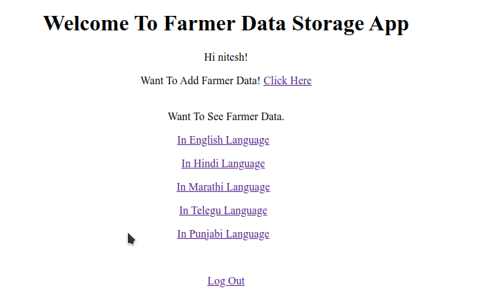
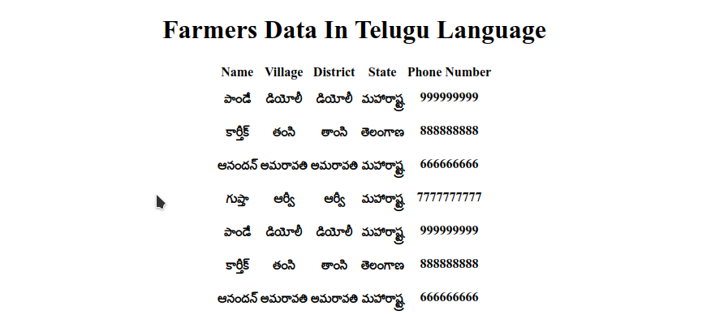

# Multi-lingual Farmer App

A web application that helps us convert farmer details from English to
different languages.

### Tech Stack Used

- Backend for API - Django RestFramework
- Frontend - Django | Django Template language | HTML | CSS
- Database - SQLite
### Steps To Set Up

#### System Requirements Assumptions
 - OS: Linux 
 - Python Version: 3.8
 - Package Installer: pip3
 - python3-virtualenv
#### Other Steps
 - Pull the GitHub repo 
    ```bash 
    git clone https://github.com/nitesh18400/FarmerApp.git
   ```
 - Enter the repo root directory
    ```bash 
    cd FarmerApp/
   ```
 - Create a python virtual environment using command
    ```bash 
    virtualenv venv
   ```
 - Activate the environment using the command
   ```bash 
    source venv/bin/Activate
   ```
 - Install the dependencies specified in requirement.txt by using the command 
    ```bash 
    pip3 install -r requirement.txt
   ```
 - Enter the FarmerApp directory
   ```bash 
    cd FarmerApp/
   ```
 - Rename credentials.json to credential-sample.json after Completing These Credentials
    ```bash
   "DEBUG": "",
   "ENVIRONMENT": "",
   "GOOGLE_API_KEY": {},
   "DJANGO_SECRET_KEY": ""
   ```
 - Database setup
   ```bash
    python3 manage.py makemigrations
    python3 manage.py migrate
   ```

 - Run the command.
   ```bash
    python3 manage.py runserver
   ```
 - The site should be live at base url - ```127.0.0.1:8000```.


### APIs Workflow

```Note:``` You can Test these APIs using [Postman](https://www.postman.com/downloads/) or By using Any Browser (Logged in Session for Authenticated APIs) 

#### - Create User 
- Description: Create New User 
- Url - ```http://127.0.0.1:8000/create-user/```
- Post Data - ```{'Username': 'Your_Username', 'Password': 'Your_Password' } type - FormData```

#### - Token Generation
- Description: Generate Token for APIs Authorization
- Url - ```http://127.0.0.1:8000/create-user/token-auth/```
- Post Data - ```{'Username': 'Your_Username', 'Password': 'Your_Password' } type - FormData```

#### - Authentication-driven APIs

#### 1. FARMER INFORMATION

- Description: Get language specific information of all the farmers in json format. 
- Url - ```http://127.0.0.1:8000/info-auth/?lang={code}``` 
- Custom Headers - ```{'Authorization' : 'Token TokenValue'}```

#### 2. Upload Farmer Data Information File

- Description: Upload Csv File Consist of Farmer in a Specified Format
- Url - ```http://127.0.0.1:8000/upload_auth/```
- Custom Headers - ```{'Authorization' : 'Token TokenValue'}```
- Post Data - ```{'file_uploaded': 'your_csv_data_file'} type - FormData(Files)```
- Assumption - Uploaded File should be of correct Format


#### - Non-Authentication-driven APIs

#### 1. FARMER INFORMATION

- Description: Get language specific information of all the farmers in json format. 
- Url - ```http://127.0.0.1:8000/info/?lang={code}```

#### 2. Upload Farmer Data Information File

- Description: Upload Csv File Consist of Farmer in a Specified Format
- Url - ```http://127.0.0.1:8000/upload/```
- Post Data - ```{'file_uploaded': 'your_csv_data_file'} type - FormData(Files)```
- Assumption - Uploaded File should be of correct Format

### View Based Workflow

1. Go to Home Page ```Url - http://127.0.0.1:8000/```


2. Click on Create User Link For New User Registration ```Url - http://127.0.0.1:8000/create-user-view/```


3. Click on Login Button if already Registered ```Url - http://127.0.0.1:8000/accounts/login/```


4. After Login Screen  ```Redirected to Home```


5. Upload Farmer Data Page ```Url - http://127.0.0.1:8000/upload-view-auth/ ``` 


6. Farmer Info Page ```Url - http://127.0.0.1:8000/info-view/{code}```


```Note:``` ``` Some more pages you can explore on your own ....```

## Running Tests

### Run tests

Run tests using command:
```bash
  coverage run --omit="/usr/*, /System/*" manage.py test
```

Converage Report (This will create a folder htmlcov and htmlcov/index.html contains Coverage Report)
```bash
  coverage html --omit="/usr/*, /System/*"
```

